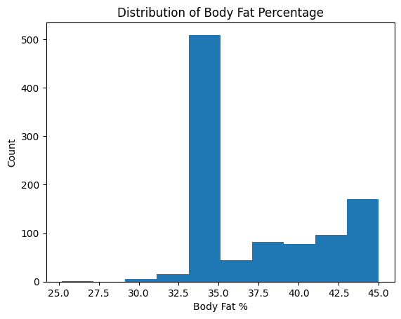

# Objective
Predict body fat % and suggest safe, evidence-based ways to reduce it without health risk.

---

# Columns of the dataset
    -age
    gender
    height_cm
    weight_kg
    waist_cm
    neck_cm
    body_fat_percent

---

# Requirements 
 Install packages like:
    -- faker (for sinthetic data generation)
    -- pandas (for file handling)
    -- numpy (for array handling)

---

# Running
open the notebook.ipynb file and click "Run All".

---

# Graph

